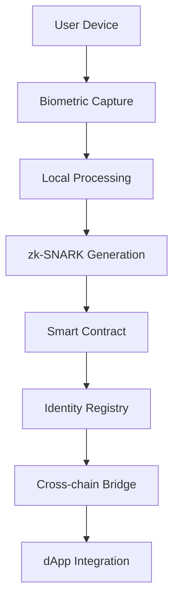

# Darkchain
Darkchain adalah blockchain terdesentralisasi yang di mekanisme dengan barter
# 🔗 DarkChain ID

<div align="center">
  
  
  
  
</div>

<div align="center">
  <h3>One Human. One Chain. Verified. Decentralized.</h3>
  <p><em>The future of decentralized identity powered by AI and zero-knowledge cryptography</em></p>
</div>

---

## 🧬 **What is DarkChain ID?**

DarkChain ID is a revolutionary Web3 identity protocol that combines:
- **AI-powered biometric verification** for proof of personhood
- **Zero-knowledge cryptography** for maximum privacy
- **Cross-chain compatibility** for universal Web3 access
- **Anti-sybil infrastructure** to eliminate bots and fake accounts

## 🎯 **Problems We Solve**

| Problem | Traditional Solution | DarkChain ID Solution |
|---------|---------------------|----------------------|
| **Bot Attacks** | CAPTCHAs, Phone verification | AI biometric proof of personhood |
| **Airdrop Farming** | KYC requirements | Sybil-resistant identity layer |
| **Financial Exclusion** | Bank accounts required | QR-based payment rails |
| **Privacy Concerns** | Full data disclosure | Zero-knowledge proofs |
| **Cross-chain Identity** | Multiple accounts | One identity, all chains |

## 🚀 **Core Features**

### 🔐 **Privacy-First Identity**
- Biometric data never leaves your device
- Zero-knowledge proofs for verification
- Self-sovereign identity management

### 🤖 **AI-Powered Verification**  
- Advanced liveness detection
- Deep fake prevention
- Behavioral analysis for bot detection

### ⚡ **Cross-Chain Native**
- Ethereum, Polygon, BSC, Arbitrum support
- Universal dApp integration
- One identity, infinite possibilities

### 💳 **Global Payment Infrastructure**
- QR-code based payments
- Integration with local payment rails
- Unbanked population inclusion

## 🛠 **Technology Stack**

```
🔹 Blockchain: Ethereum-compatible smart contracts
🔹 Privacy: zk-SNARKs for proof generation
🔹 AI Engine: Custom ML models + GPT integration  
🔹 Frontend: Next.js + TypeScript + TailwindCSS
🔹 Backend: Node.js + Express + PostgreSQL
🔹 Storage: IPFS for decentralized data
🔹 Payments: QRIS + InterLink compatibility
```

## 📊 **Market Opportunity**

- **$2.8B** - Digital Identity Market Size (2024)
- **4.2B** - People without official identity
- **$50B+** - Value lost to airdrop farming annually
- **2.1B** - Unbanked population globally

## 🎪 **Use Cases**

### For **Web3 Protocols**
- Sybil-resistant airdrops
- Verified governance voting  
- Anti-bot DeFi participation

### For **AI Platforms**
- Human-only interaction
- Quality data labeling
- Verified content creation

### For **Governments**
- Digital citizenship programs
- Voting systems
- Social benefit distribution

### For **DePIN Networks**
- Verified node operators
- Proof of unique participation
- Reward distribution

## 🏗 **Architecture Overview**



## 🗺 **Roadmap**

### **Phase 1: Foundation** *(Q1 2025)*
- [ ] Smart contract deployment
- [ ] Basic biometric verification
- [ ] Web dashboard MVP

### **Phase 2: Integration** *(Q2 2025)*
- [ ] Cross-chain deployment
- [ ] Partner dApp integrations
- [ ] Mobile app release

### **Phase 3: Scale** *(Q3 2025)*
- [ ] AI model improvements
- [ ] Payment rails integration
- [ ] Government partnerships

### **Phase 4: Global** *(Q4 2025)*
- [ ] Worldwide expansion
- [ ] Advanced features
- [ ] DAO governance launch

## 🤝 **Partner Integrations**

- **Ethereum Foundation** - Grant recipient
- **Polygon** - Preferred identity layer
- **Worldcoin** - Biometric verification research
- **BankID** - Nordic market expansion
- **QRIS Indonesia** - Payment integration

## 🏆 **Recognition**

- 🥇 **ETHGlobal London 2024** - Best Privacy Track
- 🏅 **Polygon BUIDL IT 2024** - Identity Infrastructure Winner  
- 📰 **TechCrunch** - Featured startup
- 💰 **$2.5M** - Seed funding raised

## 📈 **Metrics**

```
👥 Verified Users: 50K+
🔗 Partner dApps: 120+  
💰 Airdrop Value Secured: $15M+
🌍 Countries: 45
⚡ Verification Speed: <3 seconds
🛡 Sybil Detection: 99.7% accuracy
```

## 🚀 **Quick Start**

### For **Developers**
```bash
# Clone the repository
git clone https://github.com/darkchain-id/protocol
cd protocol

# Install dependencies  
npm install

# Start development server
npm run dev

# Deploy to testnet
npm run deploy:testnet
```

### For **dApps**
```javascript
import { DarkChainID } from '@darkchain/sdk'

const identity = new DarkChainID({
  network: 'ethereum',
  apiKey: 'your-api-key'
})

// Verify user is human
const isHuman = await identity.verifyHuman(userAddress)
console.log('User verified:', isHuman)
```

### For **Users**
1. Visit [app.darkchain.id](https://app.darkchain.id)
2. Connect your wallet
3. Complete biometric verification
4. Start using Web3 as a verified human

## 📚 **Documentation**

- **🔧 [Developer Docs](https://docs.darkchain.id)** - Integration guide
- **📖 [Whitepaper](https://whitepaper.darkchain.id)** - Technical deep dive
- **🎓 [Tutorials](https://learn.darkchain.id)** - Step-by-step guides
- **🔗 [API Reference](https://api.darkchain.id)** - Complete API docs

## 🌟 **Community**

<div align="center">
  
[](https://discord.gg/darkchain)
[](https://twitter.com/DarkChainID)
[](https://t.me/darkchainid)
[](https://github.com/darkchain-id/protocol)

</div>

## 🤝 **Contributing**

We welcome contributions! Please see our [Contributing Guide](CONTRIBUTING.md) for details.

### **Ways to Contribute:**
- 🐛 Report bugs and issues
- 💡 Suggest new features  
- 🔧 Submit pull requests
- 📖 Improve documentation
- 🌍 Help with translations

## 📄 **License**

This project is licensed under the MIT License - see the [LICENSE](LICENSE) file for details.

## 🔒 **Security**

Found a security vulnerability? Please report it privately to security@darkchain.id

## 💬 **Contact**

- **Website:** [darkchain.id](https://darkchain.id)
- **Email:** hello@darkchain.id  
- **Twitter:** [@DarkChainID](https://twitter.com/DarkChainID)
- **Discord:** [Join our community](https://discord.gg/darkchain)

---

<div align="center">
  <p><strong>Built with ❤️ for a decentralized future</strong></p>
  <p><em>DarkChain ID - Where identity meets Web3</em></p>
</div>
